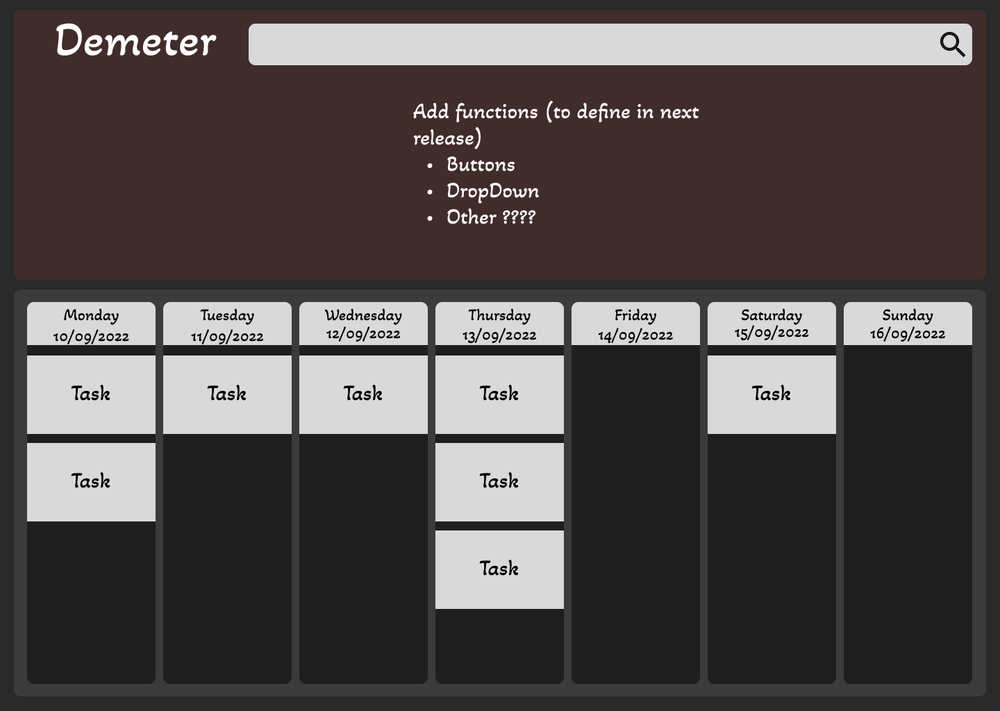
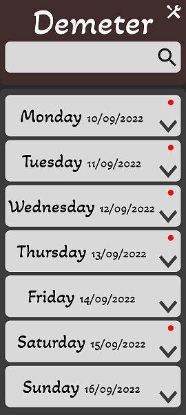

1. [Description](#description)
2. [Installation](#installation)
3. [Available Scripts](#available-scripts)
4. [Images of prototypes](#prototypes-of-the-first-release)
    1. [Web Prototype](#web)
    2. [Phone Prototype](#phone)

***

## __Description__

Demeter is just a summer project. Its purpose is to offer an electronic space where you can save and organize the different tasks to be carried out.

In the long run it is expected to be able to deal with weekly and monthly events. Such as the reminder of a medical appointment or the display of work schedules for the month or week.

***

## __Installation__

The installation of the development version will be done as for a project with [ReactJS](https://reactjs.org/).

1. Make sure you have installed a version equal to or higher than `v16.16.0` of [NodeJs](https://nodejs.org/en/).
    > With the installation of `NodeJs NPM` is already installed but we strongly recommend using [yarn](https://yarnpkg.com/). You can use the stable version or the classic version, but with the classic you may have to configure certain files.

2. Make sure you have installed a verion equal to or higher than `v2.37.1` of [GIT](https://git-scm.com/).

3. Clone the repository to the place where you want to work with it, thanks to the command `git clone https://github.com/StephanJ98/Demeter.git` .

> For the following steps, depending on whether you are using `NPM` or `Yarn`, you should use the appropriate command, depending on whether you are using `NPM` or `Yarn`. 

4. Open a command terminal and run the command:
    * `yarn`
    * `npm install`

5. Access the `backend` folder and run the command:
    * `yarn`
    * `npm install`

6. Access the `frontend` folder and run the command:
    * `yarn`
    * `npm install`

> Once these commands are executed you will have all the necessary dependencies installed. And you can start participating in the project.

## Available Scripts

In the project directory, you can run:

### `yarn start` or `npm run start`

Runs the app in the development mode.\
Open [http://localhost:3000](http://localhost:3000) to view it in your browser.

The page will reload when you make changes.\
You may also see any lint errors in the console.

### `yarn test` or `npm run test`

Launches the test runner in the interactive watch mode.\
See [running tests](https://facebook.github.io/create-react-app/docs/running-tests) for more information.

### `yarn build` or `npm run build`

Builds the app for production to the `build` folder.\
It correctly bundles React in production mode and optimizes the build for the best performance.

The build is minified and the filenames include the hashes.\
Your app is ready to be deployed!

See  [deployment](https://facebook.github.io/create-react-app/docs/deployment) for more information.

### `yarn eject` or `npm run eject`

> **Note: this is a one-way operation. Once you `eject`, you can't go back!**

If you aren't satisfied with the build tool and configuration choices, you can `eject` at any time. This command will remove the single build dependency from your project.

Instead, it will copy all the configuration files and the transitive dependencies (webpack, Babel, ESLint, etc) right into your project so you have full control over them. All of the commands except `eject` will still work, but they will point to the copied scripts so you can tweak them. At this point you're on your own.

You don't have to ever use `eject`. The curated feature set is suitable for small and middle deployments, and you shouldn't feel obligated to use this feature. However we understand that this tool wouldn't be useful if you couldn't customize it when you are ready for it.

***

## __Prototypes of the first release__

### __Web__

### __Phone__
